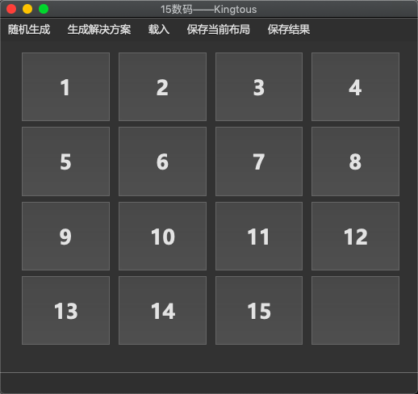

# 15 Puzzle Solver

> Created By Kingtous From CS1702,NEUQ

### Install Requirement

`pip3 install -r requirements.txt`

### Features

**Variable Heuristic Funtions**

- Wrong Postion Heuristic
- Manhattan Distance(MD)
- Manhattan Distance(MD)+Linear Conflict(Horizontal)
- Walking Distance(WD)
  - Refer to [This Picture](http://www.ic-net.or.jp/home/takaken/e/15pz/wd.gif)

**Variable Search Funtions**

- A* Method
- IDA* Method
- Greedy Method

**Use This Solver in both CLI and ALSO GUI**

- Command Line Output (Detail Message)
  - tableGenerator.py
    - Generate Layout randomly and store in .data files
  - tableSolver.py
    - Solve Current Layout in \'\_\_main\_\_\' Method
- Qt For Python(Pyside2) For Graphic User Inteface(Run gui.py Directly)
  - Play Process
  - Store Layout and Result
  - Generate Layout randomly


### Requirement

- numba
- numpy
- python3+ (**python3.7** highly recommended)


### How To Use

- Edit The Config in **tableSolver.py**
  - Default Config is **MD+LC(calc_h_3+IDA*)**

```python
def calc_h(array):
    '''
    :param array: numpy.ndarray
    :return: 一共有四种heuristic函数可供返回
    1. calc_h_1(array) 格子错位数
    2. calc_h_2(array) Manhattan距离
    3. calc_h_3(array) Manhattan距离+Linear Conflict
    3. calc_h_4(array) Walking Distance
    '''
    return calc_h_3(array)


def solveWay(arr):
    """
    :param arr: numpy.ndarray
    :return: 通过方法解决出的问题
    解决方式：
    1. Astar(arr,0) -> A*算法
    2. IDA(arr) -> IDA*算法
    """
    return IDA(arr)
```

- Start Calculator
  - ```python3.7 gui.py ``` for GUI Mode
  - ```python3.7 tableSolver.py``` for CLI Mode 



